Below, I'll show the resulting images.

# Generalized Generator
As said in the report, this model did not reach convergence due to the lack of computational resources. Further training would be needed to see if the model would converge.

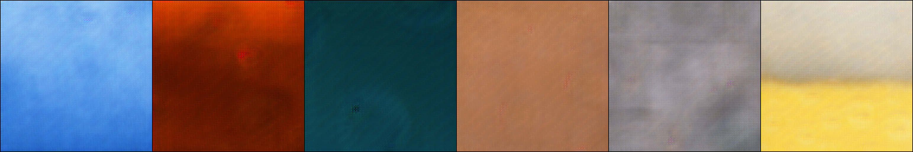

# Specialized Generator

## Roofs

### Real
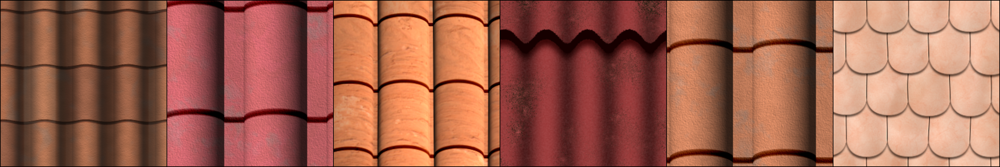
### Reconstructed
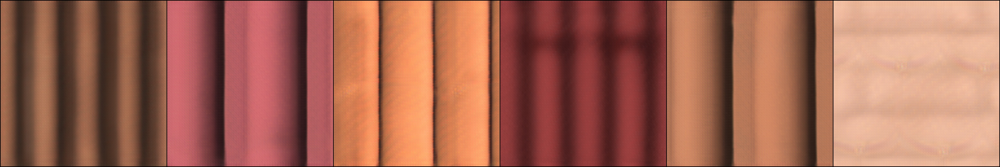

### Conditioned + Normal Noise (0, 1)
This image was generated by conditioning the generator with the image of a roof(the 4th image of the real roofs above ) plus Normal Noise (0, 1).

## Stripes

### Real
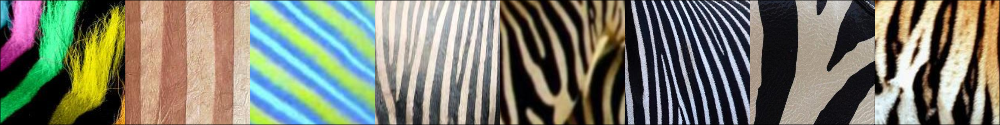
### Reconstructed
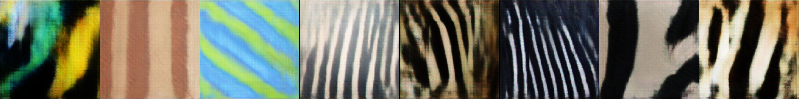

### Conditioned + Normal Noise (0, 1)
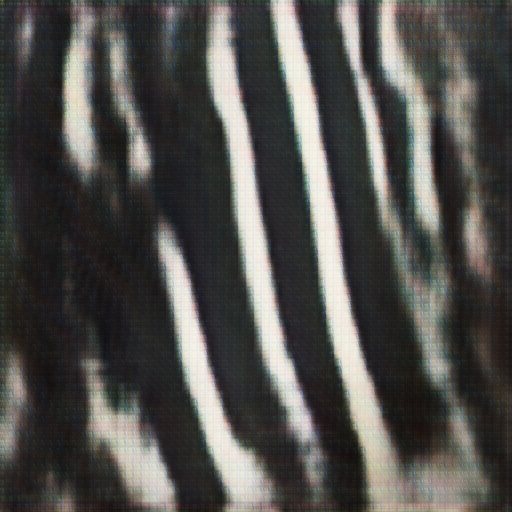 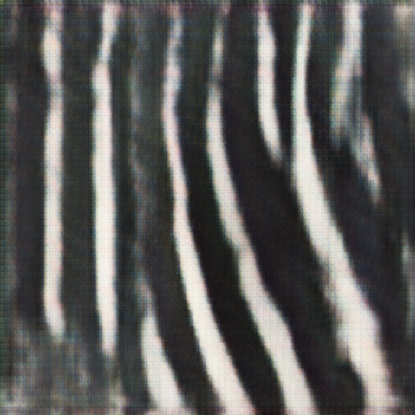 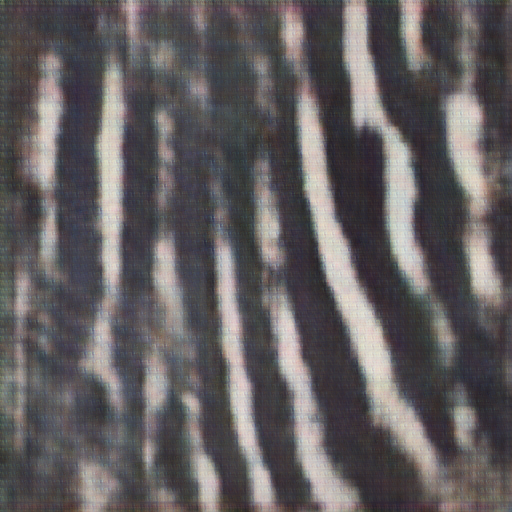

## Bubble (fail case)
### Real
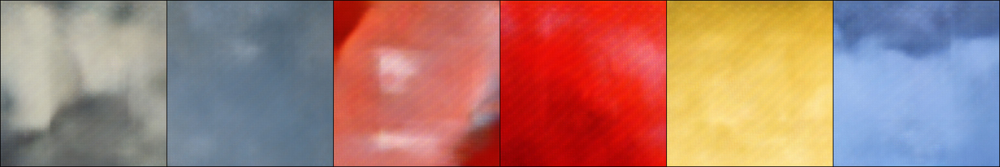
### Reconstructed
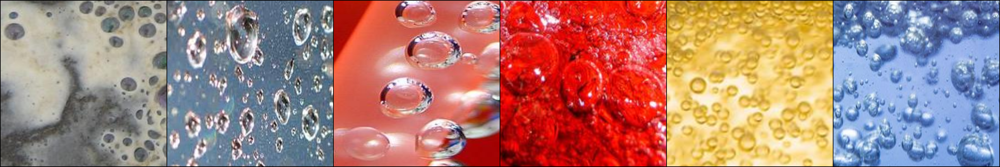

### Real
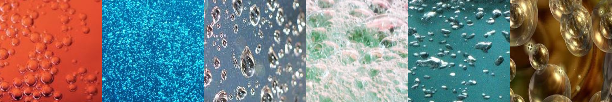
### Reconstructed
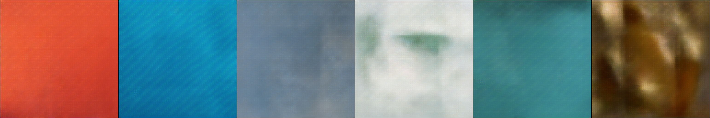

# Higly Specialized Generator

## Timber

### Real

### Reconstructed
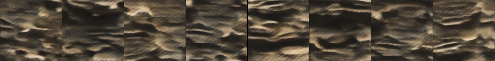

### Real

### Reconstructed
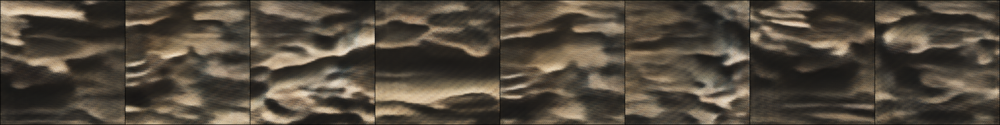

### Normal Noise (0, 1)
This image was generated by conditioning the generator with Normal Noise (0, 1) from a Normal distribution with mean 0 and standard deviation 1.

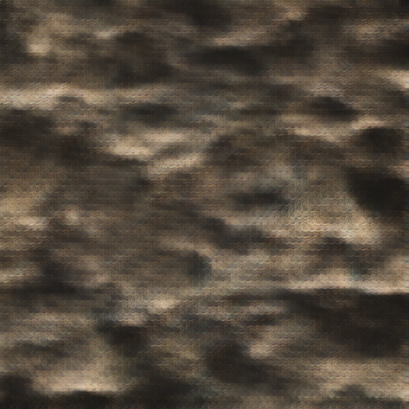 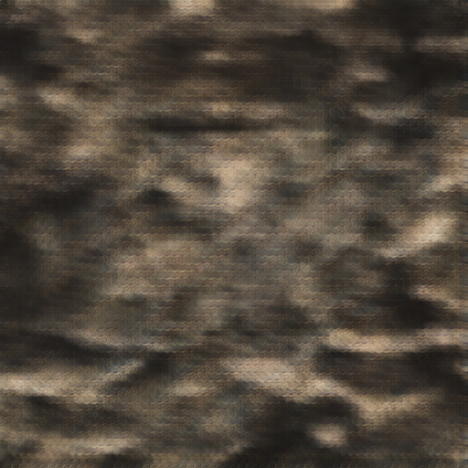

## Water

### Real

### Reconstructed
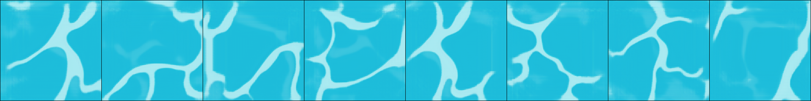

### Normal Noise (0, 1)

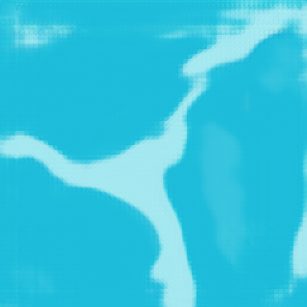 

## Grass

### Real
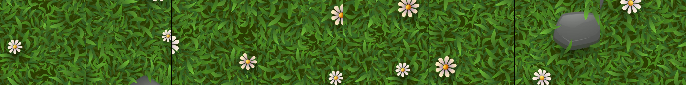
### Reconstructed
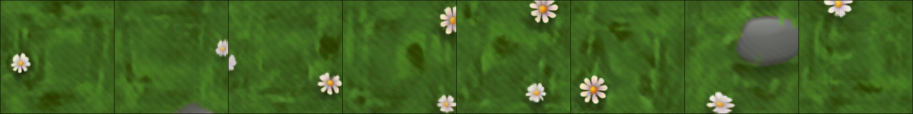

### Real
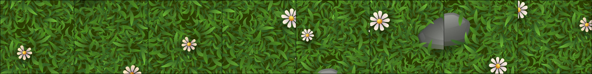
### Reconstructed
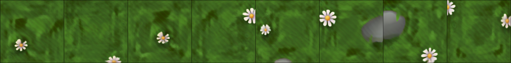

### Normal Noise (0, 1) 

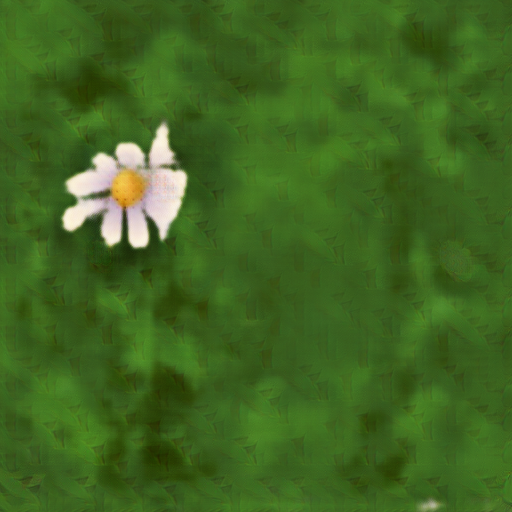

### Conditioned + Normal Noise (0, 1)

The image image

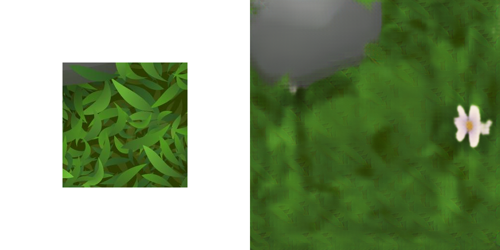

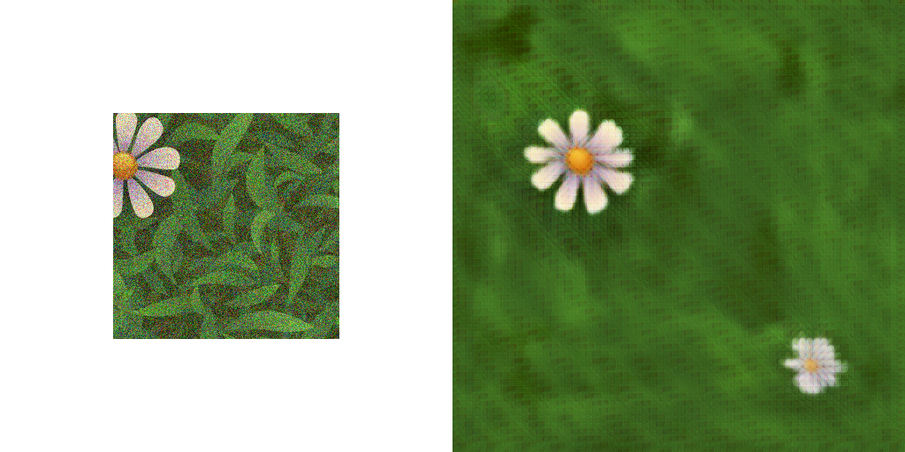

## Stars (fail case)

### Real

### Reconstructed
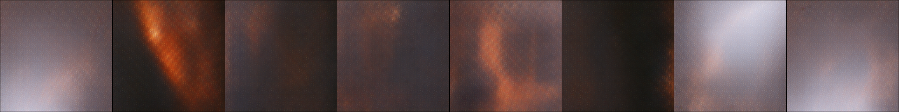

